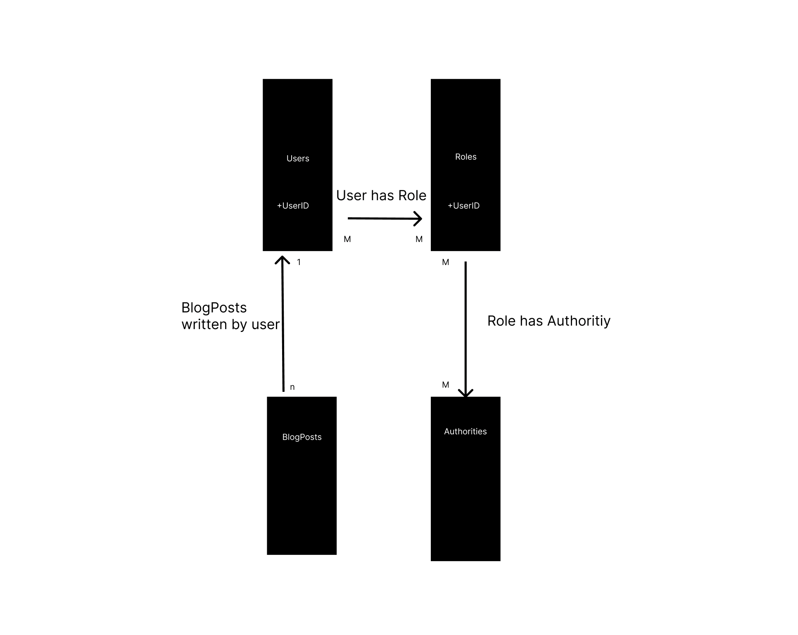
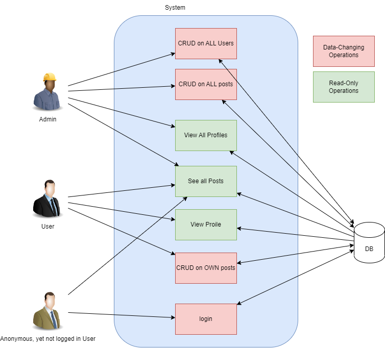
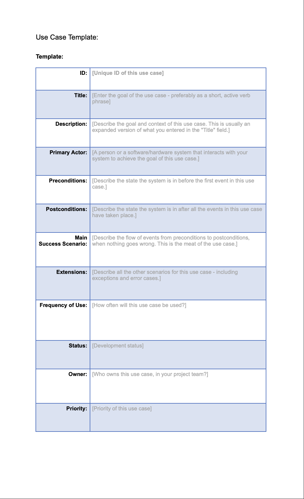
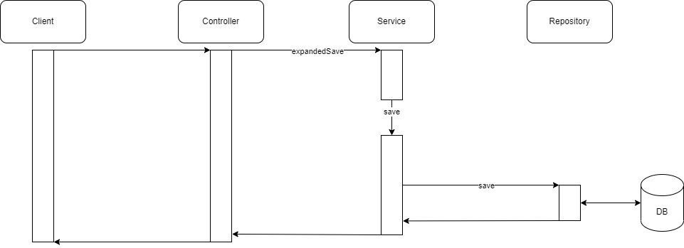

# Install

### Database
You need a postres-database running on localhost:5432. With the default settings, the username and password alike have to be 'postgres'. However, this can be changed in the application.properties file under 'uk223_BlogPost\backend\src\main\resources\application.properties'. 
If you have Docker Desktop installed, you can create a new postgres container with the default password with the following command:
`docker run --name postgres-db -e POSTGRES_USER=postgres -e POSTGRES_PASSWORD=postgres -p 5432:5432 -d postgres`

### Backend
Next open the backend folder in IntelliJ and start the backend. In the console it should inform you, when the backend is started.

### Frontend
At last, open the frontend folder in Visual Studio Code () and start the frontend in the Console with the commands `yarn`, followed by `yarn start`. For this you work you need to have npm as well as yarn installed.

**Important Note for Mac Users**: Should any problems occur whilst trying to start the frontend, try running `yarn start:safe`. This is due to an error which occured during development with the m2-chip in one of our devices. 

# Default Users

| Role  | Username          | Password |
|-------|-------------------|----------|
| Admin | admin@example.com | 1234     |
| User  | user@example.com  | 1234     |

# Testing

### Cypress
When the whole application-stack is running, you can run all cypress tests in a second  Visual Studio Code Terminal with `yarn cypress run`. More experienced Users can also use cypress with `yarn cypress open` and continue from there.

### Postman
The Postman Collection and Enviroment needs to be inported into Postman from the 'res'-Folder. Once imported, it can be run as it is in a Runner-Window. 

# Documentation

## Domain-Model

## Use-Case
#### Diagram

#### Description

## Sequenz-Diagram

